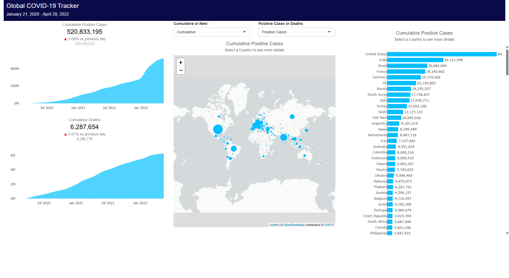
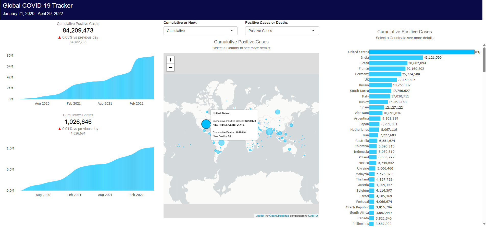

# 📊 COVID-19 Dashboard – Recreated in R

> **University Assignment** – Exchange Semester, Finland  
> The goal of this project was to recreate an existing interactive dashboard in **R using Shiny**, as part of a course focused on deepening R skills and gaining hands-on experience with real-world data analysis.

---

## 🌐 Live Demo

👉 **[Try the dashboard here](https://bastianweissmueller.shinyapps.io/DashboardCovidData/)** *(hosted on shinyapps.io)*

---

## 📸 Screenshots

**Default view – all countries:**

**Interactive view – single country selected (with hover tooltip):**

---

## ⚙️ How It Works

### Data Processing
The raw dataset (`CovidData.csv`) is loaded and preprocessed in the main `Dashboard.R` script. This includes:
- Cleaning and standardizing column formats
- Filtering out incomplete or malformed records
- Merging with `country-coord.csv` for geographic data
- Preparing reactive data structures for Shiny

### Visualizations
Each plot is encapsulated in its own script inside `plotting_methods/`. The dashboard provides two types of views for both **cases** and **deaths**:

| Type | Description |
|---|---|
| **Cumulative curve** | Total cases/deaths over time for selected countries |
| **Daily values** | New cases/deaths per day |
| **Country ranking** | Bar chart comparing countries by metric |

### Interactivity
The dashboard is built with **R Shiny** and features:
- Country selection via dropdown or click
- Hover tooltips on data points
- Dynamic chart updates based on user input

---

## 🚀 Run Locally

- Clone the repository:
- Open Dashboard.R in RStudio
- Install required packages 
- Run the app

📝 Background: This project was completed as part of a data analysis course during an exchange semester in Finland. The task was to replicate the functionality and appearance of an existing interactive dashboard (originally built with a different tool) using only R. The focus was on:
Data wrangling and preprocessing with real-world COVID-19 data, Building modular, reusable plotting functions, and Developing an interactive web application using Shiny
